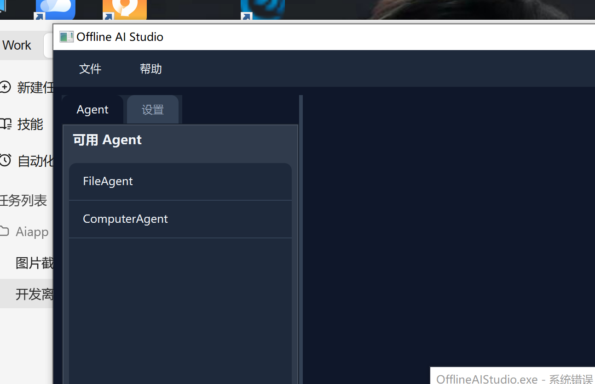

# OfflineAIStudio

> 基于 Qt 6 / C++20 的离线 AI 开发工作室 —— 多 Agent 协作、本地优先、隐私安全。

[](LICENSE)
[](https://www.qt.io/)
[](https://en.cppreference.com/w/cpp/20)
[]()

---

## 截图



---

## 功能特性

### 核心架构

- **两阶段执行模式**：LLM 生成结构化计划（JSON）→ C++ TaskScheduler 调度本地 Agent 执行，大模型不直接调用工具，安全可控
- **多 Agent 协作**：FileAgent / ComputerAgent / SearchAgent / CodeAgent 各司其职，由 Orchestrator 统一编排
- **流式输出**：SSE 实时滚动显示 LLM 响应和 Agent 调用日志
- **对话记忆**：多轮对话历史，支持最大 20 轮上下文
- **多会话管理**：会话切换时自动加载对应历史记录
- **Markdown 渲染**：代码高亮 + 富文本显示
- **深色 / 浅色主题**：Fusion 风格 + ThemeManager 全局样式表
- **配置持久化**：API 地址、模型名称等自动保存和加载

### FileAgent — 文件操作

| 能力 | 说明 |
|------|------|
| 文件读写 | 自动创建中间目录 |
| 目录操作 | 创建、删除、列出 |
| 文件管理 | 复制、移动、重命名 |
| 批量写入 | 一次调用写入多个文件 |
| 文件搜索 | 通配符匹配 |
| 文件信息 | 大小、修改时间等详情查询 |

### ComputerAgent — 系统操作

| 能力 | 说明 |
|------|------|
| 命令执行 | 白名单限制的安全命令 |
| 系统信息 | OS、CPU、内存、磁盘、网络 |
| 进程管理 | 列出、终止进程 |
| 环境变量 | 获取、设置、列出 |
| 服务管理 | 列出、启动、停止服务 |

### SearchAgent — 搜索功能

- 本地文件搜索（通配符）
- 文件内容搜索（正则表达式）
- 代码符号搜索（类、函数、变量）
- 网络搜索（在线模式可用时）

### CodeAgent — 代码开发

- 项目创建（CMake / Qt / Python 模板）
- 代码生成与编译
- 程序运行与调试
- 代码分析与统计
- 依赖检查与项目清理
- 代码格式化

---

## 架构概览

```
用户输入
   │
   ▼
┌──────────────────────────────────────┐
│           Orchestrator               │
│  ┌──────────┐    ┌────────────────┐  │
│  │ Planner  │◄───│ PromptBuilder  │  │
│  │(JSON解析)│    │(Prompt构造)    │  │
│  └────┬─────┘    └───────┬────────┘  │
│       │                  │           │
│       ▼                  ▼           │
│  ┌──────────┐    ┌────────────────┐  │
│  │TaskSched.│    │   LLMClient    │  │
│  │(任务调度)│    │  (HTTP/SSE)    │  │
│  └────┬─────┘    └────────────────┘  │
│       │                              │
└───────┼──────────────────────────────┘
        │
   ┌────┴────┬──────────┬──────────┐
   ▼         ▼          ▼          ▼
FileAgent  Computer  SearchAgent  CodeAgent
           Agent
```

**关键设计**：LLM 不直接执行工具，而是输出步骤计划。C++ 调度层逐条执行，所有工具调用经过 SecurityManager 校验。

---

## 技术栈

| 组件 | 选型 |
|------|------|
| UI 框架 | Qt 6.11+ (Widgets) |
| 语言标准 | C++20 |
| 编译器 | MinGW 13.1+ / MSVC 2022 / Clang |
| 构建系统 | CMake 3.20+ |
| 网络通信 | Qt Network (QNetworkAccessManager + SSE) |
| JSON 解析 | QJsonDocument / QJsonObject |
| 样式方案 | Qt Fusion Style + ThemeManager QSS |

---

## 快速开始

### 环境要求

- **Qt 6.11+**（含 MinGW 或 MSVC 工具链）
- **CMake 3.20+**
- **Git**
- 一台可以运行本地 LLM 的机器（如通过 Ollama），或可访问的 LLM API 端点

### 构建

```bash
# 克隆仓库
git clone https://github.com/Old-schoolprogramming/OfflineAIStudio.git
cd OfflineAIStudio

# 创建构建目录
mkdir build && cd build

# 配置 CMake（MinGW）
cmake .. -G "MinGW Makefiles" -DCMAKE_PREFIX_PATH=D:/Qt/6.11.1/mingw_64

# 配置 CMake（MSVC）
cmake .. -G "Visual Studio 17 2022" -DCMAKE_PREFIX_PATH=D:/Qt/6.11.1/msvc2022_64

# 编译
cmake --build . --config Release

# 运行
./OfflineAIStudio.exe       # Windows
./OfflineAIStudio           # macOS / Linux
```

> **注意**：将 `DCMAKE_PREFIX_PATH` 替换为你本机的 Qt 安装路径。

### 配置 API

1. 打开应用，点击右上角 **设置** 按钮
2. 填写 LLM API 地址（本地 Ollama 示例：`http://localhost:11434/v1/chat/completions`）
3. 填写模型名称（如 `qwen2.5:7b-instruct-q4_K_M`）
4. 点击 **测试连接** 验证
5. 配置自动保存，关闭设置即可开始使用

---

## 项目结构

```
OfflineAIStudio/
├── src/
│   ├── core/                     # 核心模块
│   │   ├── agent.h/cpp           # Agent 基类
│   │   ├── tool.h/cpp            # 工具抽象
│   │   ├── llmclient.h/cpp       # LLM HTTP/SSE 客户端
│   │   ├── orchestrator.h/cpp    # 总控协调器（两阶段执行）
│   │   ├── planner.h/cpp         # JSON 计划解析器
│   │   ├── promptbuilder.h/cpp   # Prompt 构造器
│   │   ├── taskscheduler.h/cpp   # 任务调度引擎
│   │   ├── task.h                # 任务数据结构
│   │   ├── conversationmanager.h/cpp  # 对话历史管理
│   │   ├── environmentdetector.h/cpp  # 环境检测
│   │   └── securitymanager.h/cpp      # 安全校验
│   ├── agents/                   # Agent 实现
│   │   ├── fileagent.h/cpp       # 文件操作 Agent
│   │   ├── computeragent.h/cpp   # 系统操作 Agent
│   │   ├── searchagent.h/cpp     # 搜索 Agent
│   │   └── codeagent.h/cpp       # 代码开发 Agent
│   ├── ui/                       # UI 组件
│   │   ├── mainwindow.h/cpp      # 主窗口
│   │   ├── chatpage.h/cpp        # 聊天页面
│   │   ├── chatwidget.h/cpp      # 聊天气泡组件
│   │   ├── thememanager.h/cpp    # 主题管理器
│   │   ├── settingspanel.h/cpp   # 设置面板
│   │   ├── outputpanel.h/cpp     # 输出日志面板
│   │   ├── tasklistpanel.h/cpp   # 任务列表面板
│   │   ├── modelconfigpage.h/cpp # 模型配置页
│   │   ├── skillimportpage.h/cpp # 技能导入页
│   │   └── agentselector.h/cpp   # Agent 选择器
│   ├── main.cpp                  # 应用入口
│   └── mainwindow.h/cpp          # 主窗口实现
├── resources/
│   └── styles.qrc                # QSS 样式资源
├── CMakeLists.txt                # CMake 构建配置
├── OfflineAIStudio.pro           # qmake 备选构建配置
├── screenshot.png                # 应用截图
└── README.md
```

---

## 安全特性

| 层级 | 机制 | 说明 |
|------|------|------|
| 参数验证 | `SecurityManager::validateParams()` | 必填参数检查、类型校验 |
| 路径安全 | `SecurityManager::validatePath()` | 防止 `../` 路径遍历攻击 |
| 命令白名单 | `SecurityManager::validateCommand()` | 仅允许执行预定义的受限命令集 |
| 危险操作过滤 | `SecurityManager::isDangerousCommand()` | 拦截 `format` / `del /s` 等危险指令 |
| 权限检查 | `checkReadPermission()` / `checkWritePermission()` | 执行前校验文件系统权限 |
| 架构隔离 | LLM 不直接调工具 | 所有工具调用由 C++ TaskScheduler 全权执行 |

---

## 离线模式

本应用设计为**离线优先**，所有核心功能均可在无网络环境运行：

- 本地 LLM（Ollama / llama.cpp）驱动
- 文件、系统、代码操作完全本地执行
- 搜索功能离线时回退到本地搜索
- 环境检测在启动时完成，无需联网

---

## 路线图

- [ ] 插件系统 —— 支持用户自定义 Agent 和 Tool
- [ ] 技能市场 —— 社区共享 Prompt 模板
- [ ] 工作区管理 —— 多项目上下文隔离
- [ ] RAG 知识库 —— 本地文档向量检索
- [ ] 代码解释器 —— 沙箱化 Python 执行
- [ ] 国际化 —— 多语言支持

---

## 许可证

本项目基于 [MIT License](LICENSE) 开源。

## 贡献

欢迎提交 Issue 和 Pull Request！建议先开 Issue 讨论改动方向，再提交 PR。

1. Fork 本仓库
2. 创建特性分支 (`git checkout -b feature/amazing-feature`)
3. 提交改动 (`git commit -m 'Add amazing feature'`)
4. 推送到分支 (`git push origin feature/amazing-feature`)
5. 创建 Pull Request
