# OfflineAIStudio 技术设计文档

> **文档版本**：v1.0  
> **编写日期**：2026年7月  
> **项目版本**：v2.0.0  
> **技术栈**：C++20 / Qt 6.11+ / Multi-Agent Architecture  
> **文档密级**：内部公开  

---

## 目录

1. [项目概述](#一项目概述)
2. [技术架构总览](#二技术架构总览)
3. [核心系统设计](#三核心系统设计)
4. [关键业务流程](#四关键业务流程)
5. [数据模型设计](#五数据模型设计)
6. [接口设计](#六接口设计)
7. [状态机设计](#七状态机设计)
8. [安全架构设计](#八安全架构设计)
9. [部署与运行架构](#九部署与运行架构)
10. [技术选型与约束](#十技术选型与约束)
11. [扩展性设计](#十一扩展性设计)
12. [项目演进路线](#十二项目演进路线)

---

## 一、项目概述

### 1.1 项目背景

随着大语言模型（LLM）技术的快速发展，企业对于**数据隐私**和**离线可控**的智能助手需求日益增强。市面上主流方案采用"大模型直连执行"模式，即 LLM 直接决定调用哪些工具、执行哪些命令，存在以下风险：

- **安全风险**：大模型可能产生"幻觉"，执行危险或不可预期的系统操作
- **可控性弱**：执行过程黑盒化，无法审计、无法中断
- **离线能力缺失**：依赖云端 API 和网络连接，无法在内网/隔离环境运行

### 1.2 项目定位

**OfflineAIStudio**（离线AI工作室）是一款面向本地/离线环境的**企业级智能助手平台**，采用**"大模型决策 + C++ 调度层执行"**的分离式架构，实现 AI 能力的本地私有化部署。

### 1.3 核心设计目标

| 设计目标 | 具体措施 | 领导视角价值 |
|---------|---------|------------|
| **安全可控** | LLM 只输出 JSON 决策计划，不直接操作系统；所有执行经 C++ 层校验 | 消除 AI "失控" 风险，满足企业合规审计要求 |
| **离线优先** | 100% 功能可在无网络环境运行，支持本地模型（Ollama 等） | 适配内网、涉密、工控等隔离环境 |
| **透明可追溯** | 每一步执行过程在 UI 中可视化展示，计划可人工审查 | 操作全留痕，符合企业治理规范 |
| **可扩展** | Agent 插件化设计，新增能力零侵入核心调度 | 支持业务定制化扩展，保护长期投资 |

---

## 二、技术架构总览

### 2.1 分层架构图

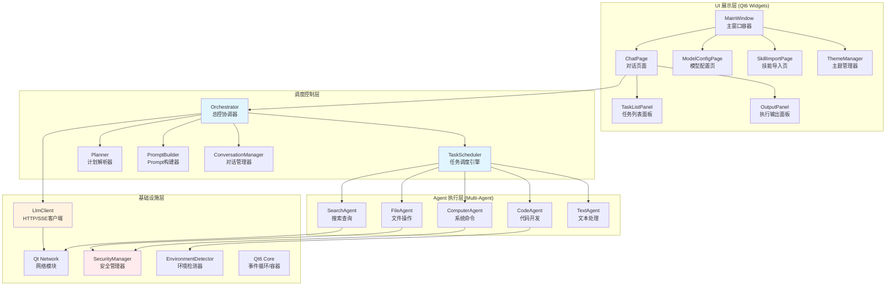

### 2.2 架构设计思想

本系统采用 **"决策-执行分离"（Separation of Decision and Execution, SDE）** 架构模式：

1. **决策层（LLM）**：负责理解用户意图，生成结构化的 JSON 执行计划
2. **调度层（C++）**：负责解析计划、校验合法性、按步骤调度 Agent 执行
3. **执行层（Agent）**：负责调用操作系统能力完成具体任务

这种三层分离设计使系统具备**银行级的可控性**——即使 AI 产生误判，也无法越权执行任何操作。

---

## 三、核心系统设计

### 3.1 核心类图（UML）

```mermaid
classDiagram
    direction TB

    class QObject {
        +signals/slots
        +parent/children
    }

    class Agent {
        <<abstract>>
        +name() QString*
        +description() QString*
        +type() AgentType*
        +tools() QList~Tool*~*
        +executeTool(toolName, args) QVariantMap*
        +formatToolsForPrompt() QString
        #executionStarted(agentName)
        #executionCompleted(agentName, result)
        #executionError(agentName, error)
    }

    class Tool {
        +name() QString
        +description() QString
        +addParameter(name, type, desc, required)
        +parameters() QList~Parameter~
        +formatForPrompt() QString
    }

    class Orchestrator {
        +setLlmClient(client)
        +addAgent(agent)
        +processQuery(query)
        +processQueryWithFiles(query, files)
        +stopExecution()
        +isProcessing() bool
        +currentPlan() TaskPlan
        #logMessage(logType, message)
        #planGenerated(plan)
        #stepStarted(stepId)
        #stepOutput(stepId, output)
        #stepCompleted(stepId, result)
        #stepFailed(stepId, error)
        #planCompleted(plan)
        -sendPlanningRequest(query)
        -retryPlanWithFeedback(failedPlan)
        -detectTaskType(query, files) TaskType
    }

    class TaskScheduler {
        +registerAgent(agent)
        +setPlan(plan)
        +startExecution()
        +stopExecution()
        +isRunning() bool
        +currentPlan() TaskPlan
        #planReceived(plan)
        #stepStarted(stepId)
        #stepOutput(stepId, output)
        #stepCompleted(stepId, result)
        #stepFailed(stepId, error)
        #planCompleted(plan)
        #executionStopped()
        -executeNextStep()
        -findAgentForTool(toolName) Agent*
    }

    class Planner {
        +parseResponse(llmResponse) ParsedResponse
        +parsePlanFromJson(obj) TaskPlan
        +parsePlan(llmResponse) TaskPlan
        +extractJsonBlock(text) QString
        +validatePlan(plan) bool
        -parseStep(stepObj) TaskStep
    }

    class LlmClient {
        +setApiUrl(url)
        +setModelName(name)
        +setMaxTokens(tokens)
        +setTemperature(temp)
        +sendPrompt(prompt, systemPrompt)
        +sendMessages(messages, stream)
        #responseReceived(response)
        #responseChunk(chunk)
        #responseError(error)
        -processSseStream()
    }

    class FileAgent {
        +executeTool(toolName, args) QVariantMap
        -readFile(args) QVariantMap
        -writeFile(args) QVariantMap
        -listFiles(args) QVariantMap
        -createDirectory(args) QVariantMap
        -copyFile(args) QVariantMap
        -moveFile(args) QVariantMap
        -batchWriteFiles(args) QVariantMap
    }

    class ComputerAgent {
        +executeTool(toolName, args) QVariantMap
        -runCommand(args) QVariantMap
        -getSystemInfo(args) QVariantMap
        -listProcesses(args) QVariantMap
        -getEnvironmentVariable(args) QVariantMap
        -listServices(args) QVariantMap
    }

    class CodeAgent {
        +executeTool(toolName, args) QVariantMap
        +setEnvironmentDetector(detector)
        -createProject(args) QVariantMap
        -compileProject(args) QVariantMap
        -runProgram(args) QVariantMap
        -analyzeCode(args) QVariantMap
        -generateTests(args) QVariantMap
        -refactorCode(args) QVariantMap
    }

    class SearchAgent {
        +executeTool(toolName, args) QVariantMap
        -webSearch(args) QVariantMap
        -searchFiles(args) QVariantMap
        -searchText(args) QVariantMap
        -searchCode(args) QVariantMap
    }

    class TextAgent {
        +executeTool(toolName, args) QVariantMap
        -base64Encode(args) QVariantMap
        -md5Hash(args) QVariantMap
        -jsonFormat(args) QVariantMap
        -replaceText(args) QVariantMap
    }

    class SecurityManager {
        +validateParams(args, requiredParams) QVariantMap$
        +validatePath(path, allowParent) QVariantMap$
        +validateCommand(command, allowedCommands) QVariantMap$
        +isDangerousCommand(command) bool$
        +sanitizeFileName(fileName) QString$
    }

    class ConversationManager {
        +addUserMessage(content)
        +addAssistantMessage(content)
        +createNewConversation() int
        +switchConversation(index)
        +buildMessageHistory(systemPrompt) QJsonArray
        +loadFromJson(conversations)
        +toJson() QJsonArray
    }

    class ThemeManager {
        +instance() ThemeManager*$
        +currentTheme() Theme
        +setTheme(theme)
        +toggleTheme()
        +background() QColor
        +primary() QColor
        +styleSheet() QString
        #themeChanged(theme)
    }

    QObject <|-- Agent
    Agent <|-- Orchestrator
    Agent <|-- FileAgent
    Agent <|-- ComputerAgent
    Agent <|-- CodeAgent
    Agent <|-- SearchAgent
    Agent <|-- TextAgent

    Orchestrator "1" --> "1" LlmClient : uses
    Orchestrator "1" --> "1" TaskScheduler : owns
    Orchestrator "1" --> "1" Planner : uses
    Orchestrator "1" --> "1" ConversationManager : owns
    Orchestrator "1" --> "0..*" Agent : manages

    TaskScheduler "1" --> "0..*" Agent : routes

    FileAgent ..> SecurityManager : uses
    ComputerAgent ..> SecurityManager : uses
    CodeAgent ..> EnvironmentDetector : uses
    SearchAgent ..> SecurityManager : uses

    Agent "1" --> "0..*" Tool : owns
    Tool "1" --> "0..*" Parameter : contains

    ThemeManager : <<singleton>>
```

### 3.2 模块职责矩阵

| 模块 | 类型 | 核心职责 | 设计模式 |
|------|------|---------|---------|
| **Orchestrator** | 协调器 | 两阶段执行总控、信号代理、任务类型识别 | 外观模式 + 中介者模式 |
| **TaskScheduler** | 调度器 | Agent 路由、步骤顺序执行、状态追踪 | 责任链模式 |
| **Planner** | 解析器 | JSON 计划提取、验证、结构化转换 | 策略模式 |
| **PromptBuilder** | 构造器 | 系统提示词/用户提示词生成 | 建造者模式 |
| **SecurityManager** | 安全层 | 参数校验、路径安全、命令白名单 | 代理模式 |
| **ConversationManager** | 数据层 | 多会话管理、历史持久化 | 仓库模式 |
| **ThemeManager** | UI 基础 | 主题状态管理、全局样式生成 | 单例模式 |

---

## 四、关键业务流程

### 4.1 两阶段执行主流程（时序图）

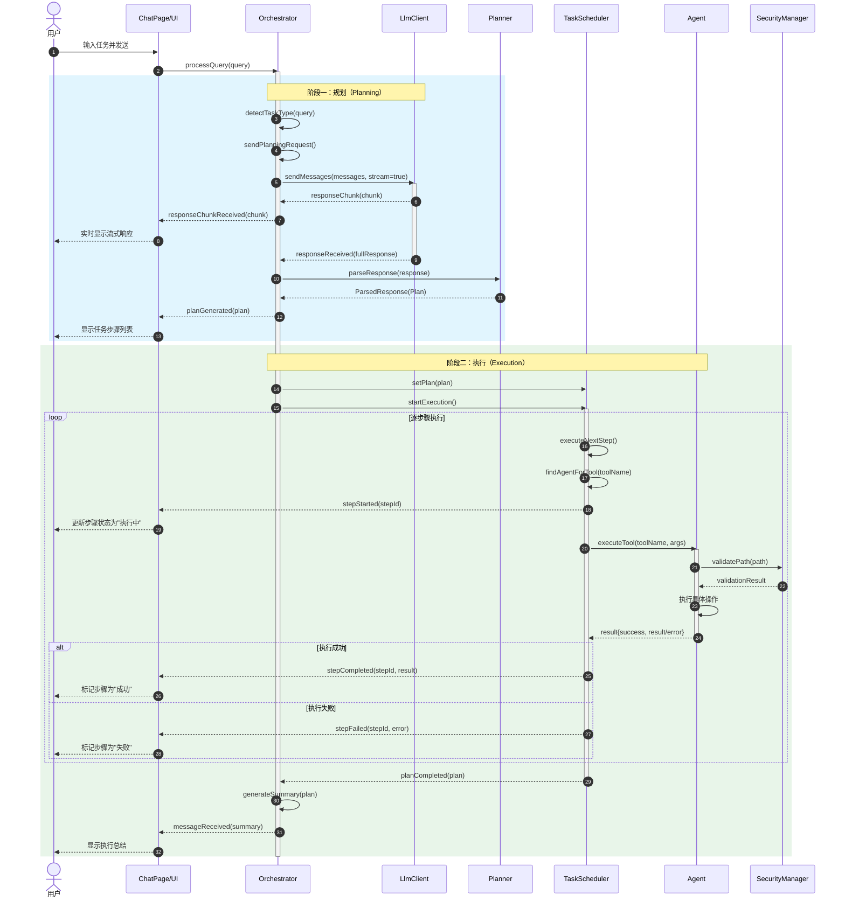

### 4.2 任务类型识别与路由流程（流程图）

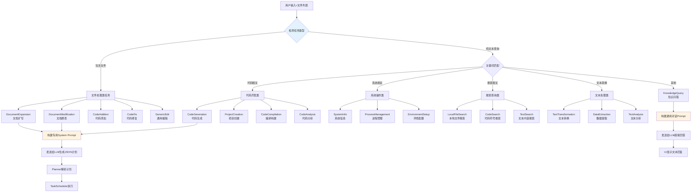

### 4.3 文件处理任务详细流程

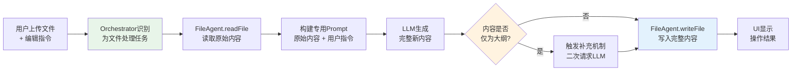

---

## 五、数据模型设计

### 5.1 核心数据结构

```mermaid
classDiagram
    class TaskStep {
        +int stepId
        +QString agent
        +QString tool
        +QVariantMap args
        +QString description
        +StepStatus status
        +QString output
        +QString error
        +QDateTime startTime
        +QDateTime endTime
        +statusToString() QString
    }

    class TaskPlan {
        +QString planId
        +QString goal
        +QList~TaskStep~ steps
        +QDateTime createdAt
        +totalSteps() int
        +completedSteps() int
        +isComplete() bool
    }

    class ConversationManager::Message {
        +QString role
        +QString content
        +QString timestamp
    }

    class ConversationManager::Conversation {
        +QString id
        +QString title
        +QString createdAt
        +QList~Message~ messages
        +bool isActive
    }

    class EnvironmentDetector::ToolInfo {
        +QString name
        +QString path
        +QString version
        +bool available
    }

    TaskPlan "1" --> "0..*" TaskStep : contains
    ConversationManager::Conversation "1" --> "0..*" ConversationManager::Message : contains
```

### 5.2 步骤状态机

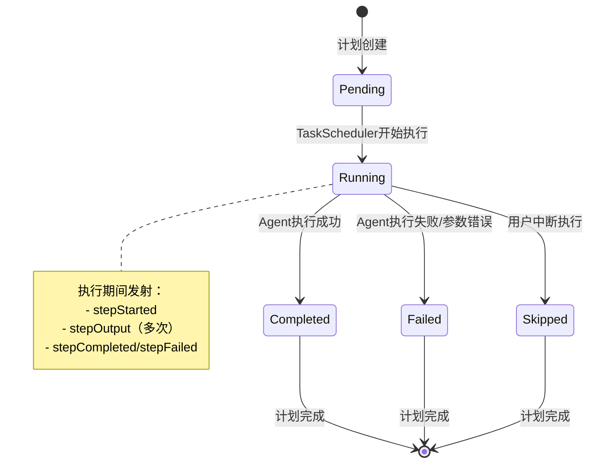

---

## 六、接口设计

### 6.1 内部模块接口（信号槽总线）

系统采用 **Qt 信号槽机制** 实现模块间完全解耦通信，核心信号总线如下：

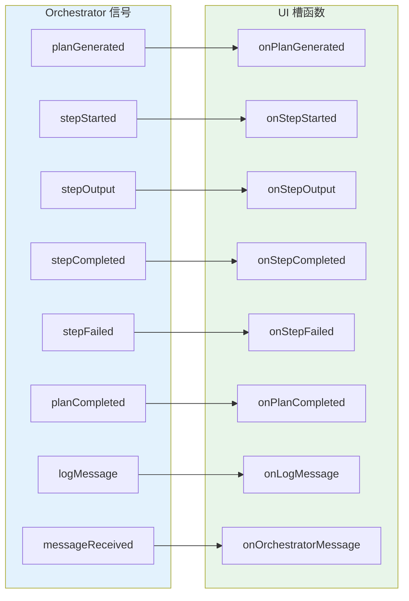

### 6.2 Agent 抽象接口

所有 Agent 遵循统一的抽象契约：

```cpp
// Agent 基类纯虚接口
virtual QString     name() const = 0;                          // Agent 名称
virtual QString     description() const = 0;                   // 功能描述
virtual AgentType   type() const = 0;                          // 类型枚举
virtual QList<Tool*> tools() const = 0;                        // 工具清单
virtual QVariantMap executeTool(const QString& toolName,       // 工具执行入口
                                const QVariantMap& args) = 0;
```

### 6.3 外部 API 接口（LLM 通信）

系统通过标准 OpenAI 兼容 API 与 LLM 通信：

```
请求端点: POST {configured_api_url}/chat/completions
请求格式: {
    "model": "qwen2.5:7b",
    "messages": [{"role": "system", ...}, {"role": "user", ...}],
    "stream": true,
    "temperature": 0.7,
    "max_tokens": 8192
}
响应格式: Server-Sent Events (SSE) 流式响应
```

---

## 七、状态机设计

### 7.1 Orchestrator 处理状态机

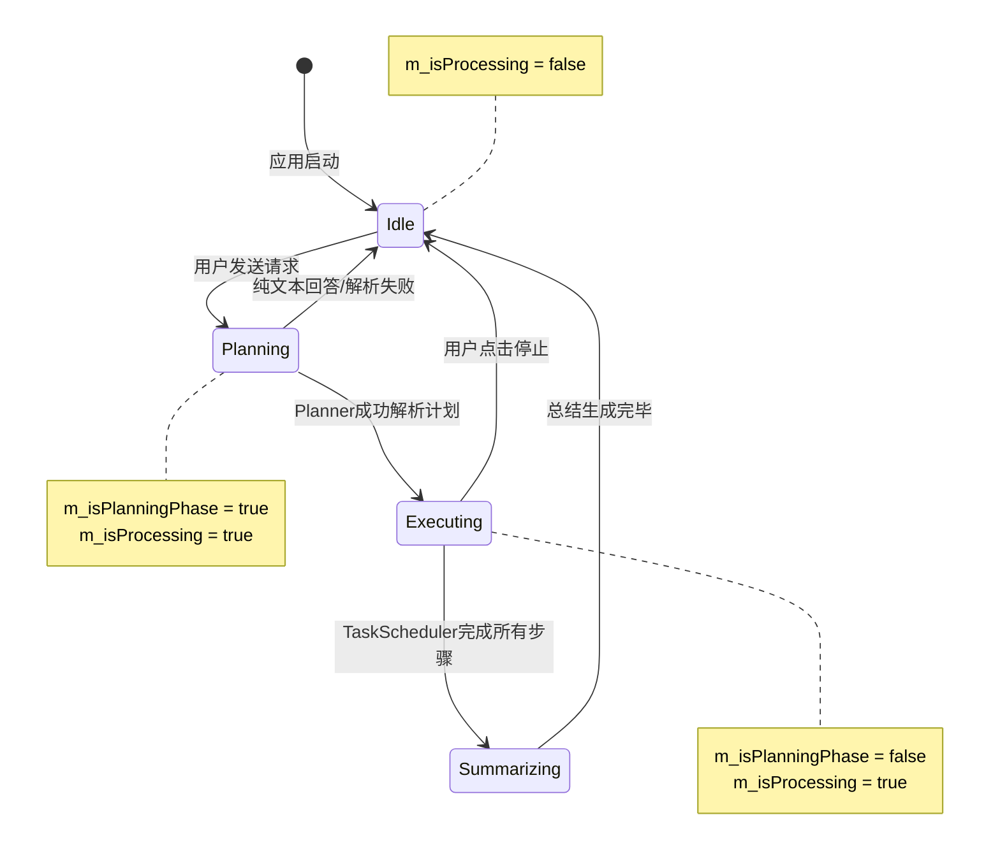

### 7.2 任务调度器状态机

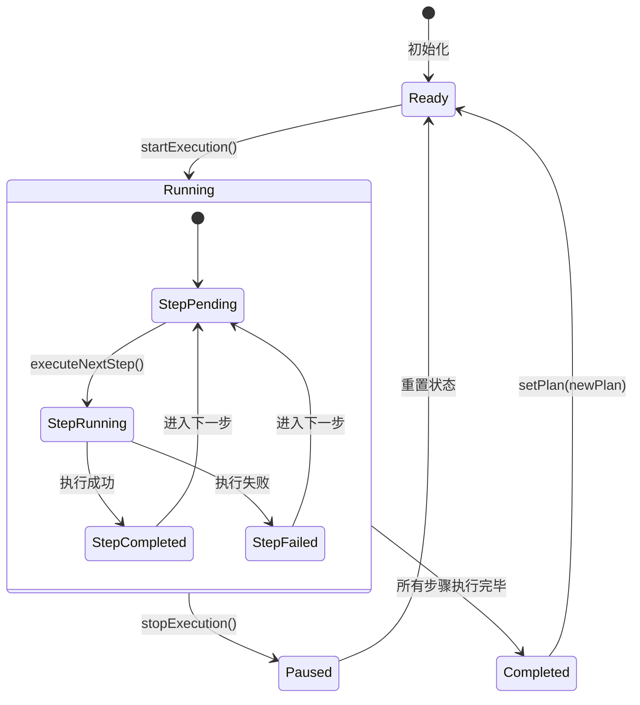

---

## 八、安全架构设计

### 8.1 纵深防御体系

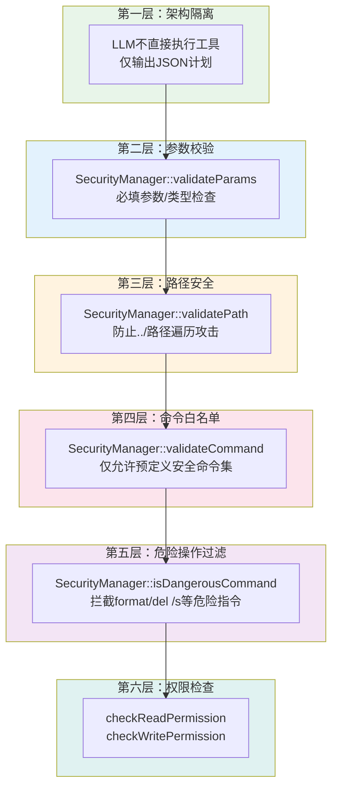

### 8.2 安全策略矩阵

| 层级 | 安全机制 | 防护目标 | 实现位置 |
|------|---------|---------|---------|
| 架构层 | 决策-执行分离 | 防止 AI 幻觉导致危险操作 | Orchestrator 两阶段设计 |
| 输入层 | 参数必填校验 | 防止缺失参数导致异常 | SecurityManager::validateParams |
| 文件层 | 路径遍历防护 | 防止访问系统敏感目录 | SecurityManager::validatePath |
| 命令层 | 白名单机制 | 防止执行任意系统命令 | SecurityManager::validateCommand |
| 语义层 | 危险指令识别 | 拦截格式化、递归删除等 | SecurityManager::isDangerousCommand |
| 系统层 | 文件权限校验 | 防止越权读写 | checkRead/WritePermission |

---

## 九、部署与运行架构

### 9.1 部署架构图

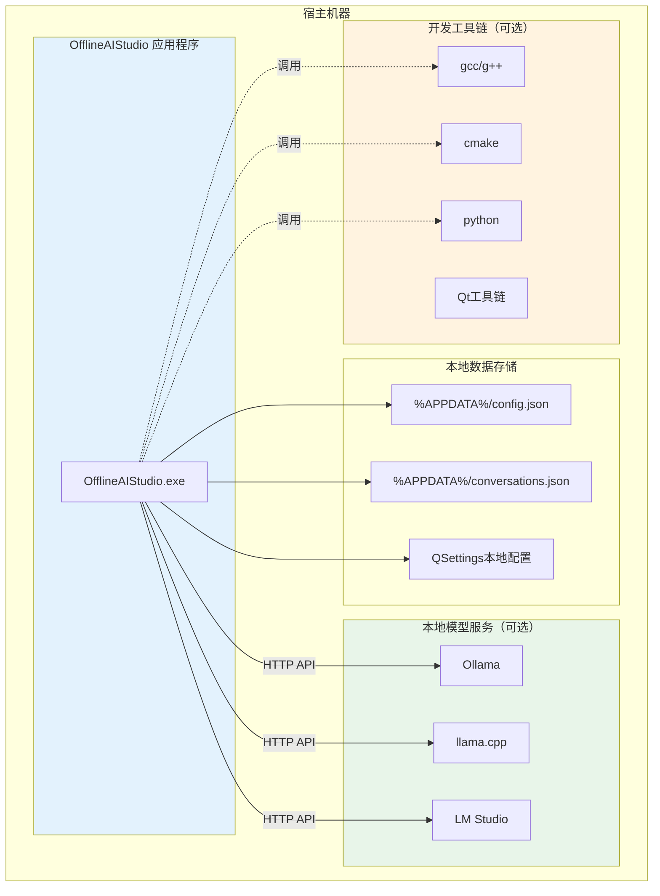

### 9.2 运行环境要求

| 组件 | 最低要求 | 推荐配置 |
|------|---------|---------|
| 操作系统 | Windows 10 / macOS 12 / Ubuntu 20.04 | Windows 11 / macOS 14 / Ubuntu 22.04 |
| CPU | x86_64 双核 | x86_64 四核以上 |
| 内存 | 4 GB | 16 GB（运行 7B 模型）|
| 磁盘 | 200 MB | 500 MB |
| 网络 | 无要求（离线优先） | 内网环境（本地模型）|
| Qt 运行时 | Qt 6.11+ | Qt 6.11+ |

---

## 十、技术选型与约束

### 10.1 技术栈选型

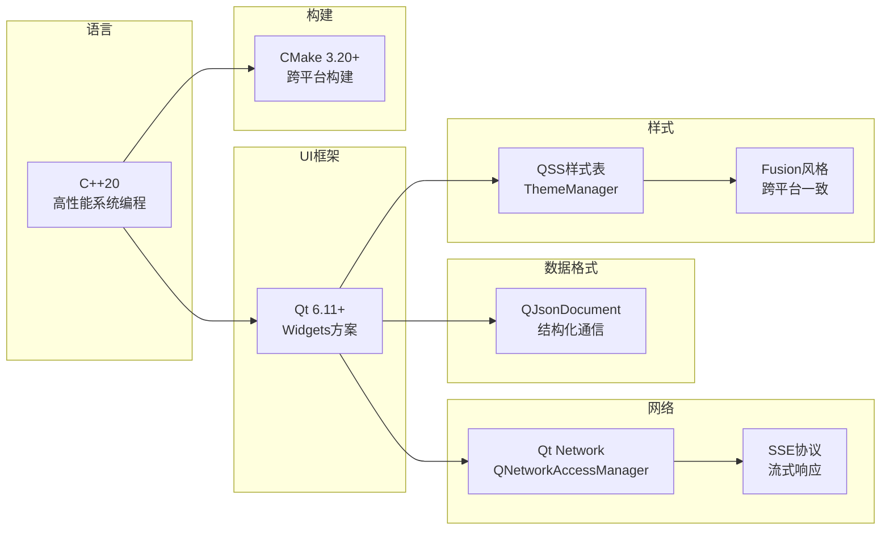

### 10.2 选型决策分析

| 技术点 | 选型 | 备选方案 | 决策理由 |
|--------|------|---------|---------|
| UI 框架 | Qt Widgets | Qt Quick/QML | Widgets 更成熟稳定，适合桌面生产力工具 |
| 通信协议 | HTTP + SSE | WebSocket | SSE 更简单可靠，单向流满足需求 |
| 计划格式 | JSON | XML/YAML | LLM 对 JSON 理解最好，解析库成熟 |
| 架构模式 | 决策-执行分离 | Function Calling | 不依赖特定模型，通用性最强 |
| 线程模型 | 单线程+信号槽 | 多线程线程池 | Qt 事件循环足够，避免并发复杂度 |

### 10.3 关键约束

- **离线优先**：所有网络相关功能必须提供离线降级方案
- **本地模型兼容**：支持 OpenAI 兼容格式的本地模型端点
- **跨平台**：同一套代码支持 Windows/macOS/Linux
- **无外部依赖**：除 Qt 外不依赖第三方库，降低部署复杂度

---

## 十一、扩展性设计

### 11.1 Agent 扩展机制

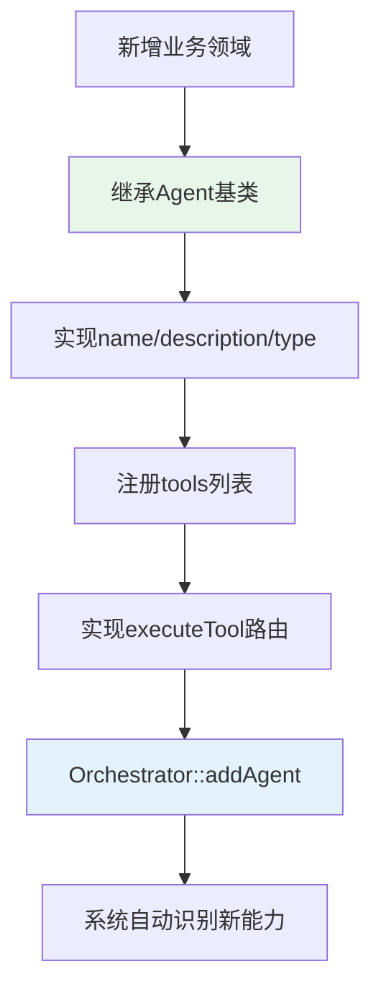

### 11.2 扩展能力矩阵

| 扩展方向 | 工作量 | 侵入性 | 示例场景 |
|---------|--------|--------|---------|
| 新增 Agent | ~1 天 | 零侵入 | 数据库操作 Agent、浏览器控制 Agent |
| 新增工具 | ~2 小时 | 低侵入 | FileAgent 新增压缩/解压工具 |
| 新增任务类型 | ~4 小时 | 低侵入 | 支持 "PPT 生成" 任务识别 |
| 新增主题 | ~30 分钟 | 零侵入 | ThemeManager 新增高对比度主题 |
| 支持新 LLM | ~2 小时 | 低侵入 | 接入本地 vLLM 服务 |

### 11.3 未来架构演进

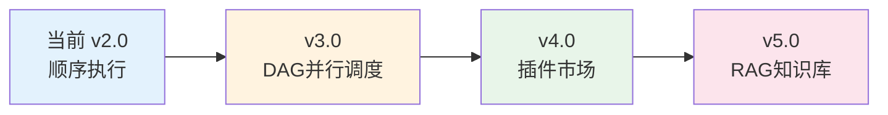

---

## 十二、项目演进路线

### 12.1 版本演进

| 版本 | 核心特性 | 架构改进 |
|------|---------|---------|
| **v1.0** | ReAct 风格工具调用 | LLM 直接输出工具调用格式 |
| **v2.0（当前）** | JSON 计划驱动 + 多 Agent | 决策-执行分离、TaskScheduler 调度 |
| **v3.0（规划）** | DAG 并行步骤、插件系统 | 步骤依赖图、动态加载 Agent |
| **v4.0（规划）** | RAG 本地知识库 | 向量检索、文档 Embedding |
| **v5.0（规划）** | 代码解释器沙箱 | 隔离 Python 执行环境 |

### 12.2 当前版本核心指标

| 指标 | 数值 | 说明 |
|------|------|------|
| 代码总行数 | ~15,000+ 行 | C++ 源码 |
| 核心模块数 | 5 个 Agent + 8 个核心类 | 高内聚低耦合 |
| UI 组件数 | 12 个自定义组件 | 覆盖完整交互场景 |
| 工具总数 | 60+ 个 | 覆盖文件/系统/代码/搜索/文本 |
| 单元测试覆盖率 | 规划中 | v3.0 目标 |
| 支持平台 | Windows/macOS/Linux | Qt 跨平台保证 |

---

## 附录

### A. 术语表

| 术语 | 英文 | 解释 |
|------|------|------|
| Agent | 智能代理 | 系统中负责特定领域任务执行的模块 |
| LLM | 大语言模型 | 提供自然语言理解与生成能力的 AI 模型 |
| SSE | Server-Sent Events | 服务器推送事件，用于流式响应 |
| Prompt | 提示词 | 发送给大模型的输入文本 |
| 两阶段执行 | Two-Phase Execution | 先规划（Planning）后执行（Execution）的模式 |
| QSS | Qt Style Sheets | Qt 的样式表机制，类似 CSS |

### B. 文档变更记录

| 版本 | 日期 | 变更内容 | 作者 |
|------|------|---------|------|
| v1.0 | 2026-07 | 初始版本，涵盖 v2.0 完整架构 | 技术团队 |

---

> **文档结束**
